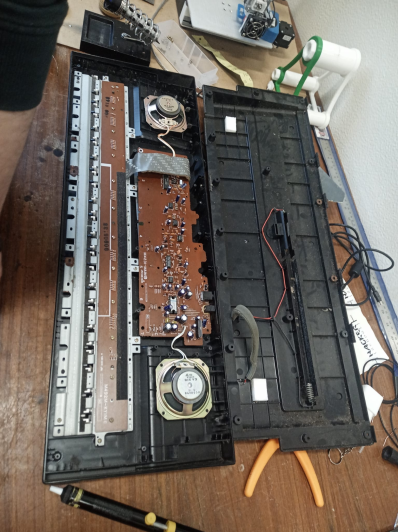

# MIDI-Keyboard
Welcome to the MIDI-Keyboard Project!

Our goal is to take a regular eletronic keyboard with no digital capabilities whatsoever and turn it into a fully functional MIDI Keyboard, using a microcontroller. 

<!--  -->

    

        
    

    

        
    

    

        <video controls width="100%">
            <source src="ItsAlive.mp4" type="video/mp4">
            Your browser does not support the video tag.
        </video>
    

(President Marcelo Rebelo de Sousa trying our midi at SINFO 23.)
