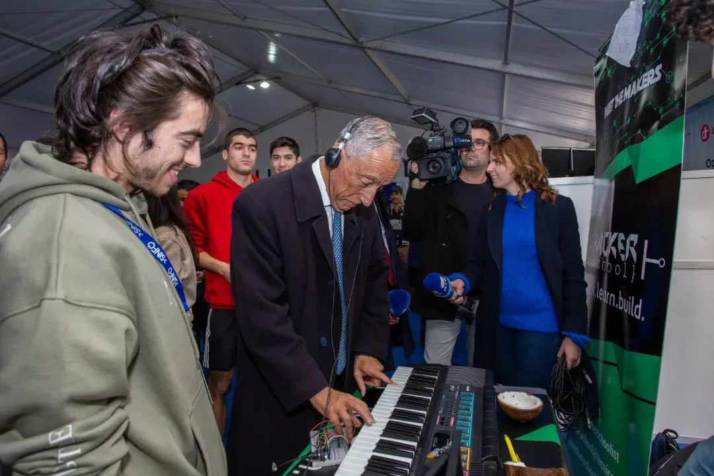
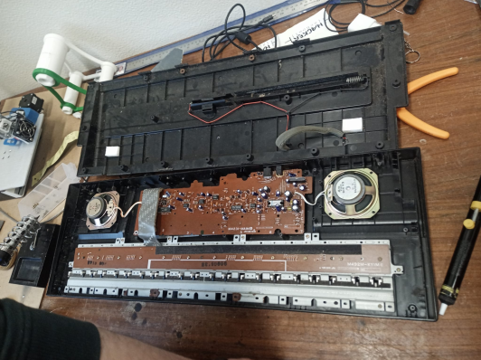

# MIDI-Keyboard
Welcome to the MIDI-Keyboard Project!

Our goal is to take a regular eletronic keyboard with no digital capabilities whatsoever and turn it into a fully functional MIDI Keyboard, using a microcontroller. 

<!--  -->

  

    
    
(President Marcelo Rebelo de Sousa trying our midi at SINFO 23.)
  

  

    
  

  

https://github.com/mr-arpg/midi-keyboard/assets/71014048/0359e945-be01-4bf6-b2ac-8d80e95041af

(President Marcelo Rebelo de Sousa trying our midi at SINFO 23.)
